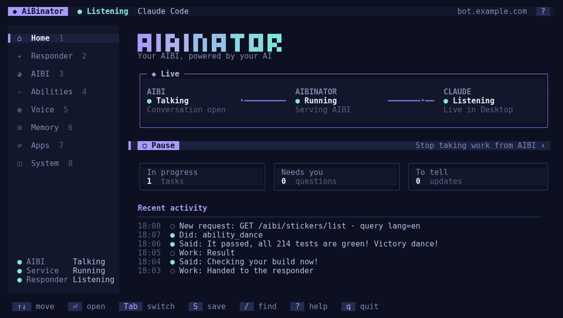
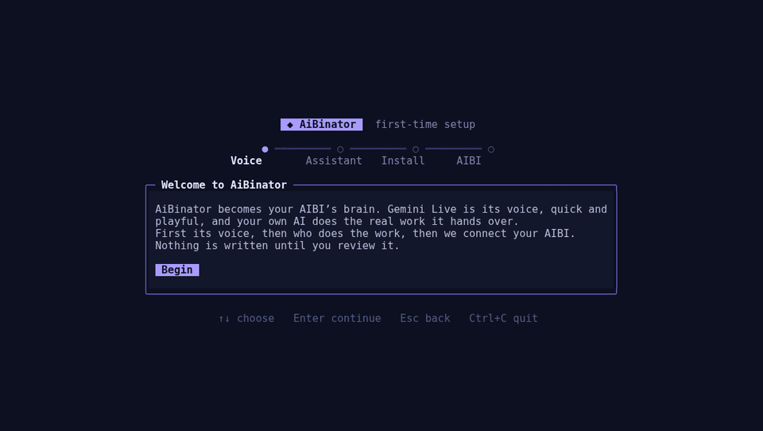

<a id="top"></a>

<p align="center">
  <picture>
    <source media="(prefers-color-scheme: dark)" srcset="docs/media/banner-dark.svg">
    <source media="(prefers-color-scheme: light)" srcset="docs/media/banner-light.svg">
    
  </picture>
</p>

<p align="center">
  <a href="https://github.com/DevL0rd/AiBinator/actions/workflows/quality.yml"></a>
  
  
  <a href="LICENSE"></a>
  <a href="https://github.com/DevL0rd/AiBinator/stargazers"></a>
</p>

<h3 align="center">Your AIBI, powered by your AI.</h3>

<p align="center">
  Give your AIBI pocket robot a new brain that runs on your own computer.<br>
  Gemini Live is its quick, playful voice, and Claude Code or Codex does the real work it hands over,<br>
  with one memory, the same Coordinator as Discordinator, and you in control of what it may do.
</p>

<p align="center">
  <a href="#get-started"><b>Get started</b></a> ·
  <a href="#see-it-work"><b>See it work</b></a> ·
  <a href="#who-answers"><b>Who does the work</b></a> ·
  <a href="#apps"><b>Connected apps</b></a> ·
  <a href="#control"><b>Stay in control</b></a> ·
  <a href="#docs"><b>Docs</b></a> ·
  <a href="#more"><b>More projects</b></a>
</p>

<p align="center">
  
</p>

---

<a id="get-started"></a>

## 🚀 Get started

```sh
git clone https://github.com/DevL0rd/AiBinator.git aibinator
cd aibinator
npm ci --ignore-scripts
npm run aibinator
```

The setup app walks you through everything on first run: AIBI’s voice, who does the work, installing, and pointing your AIBI at this computer. It waits until AIBI calls before it says you are done. Nothing is written until you review it.

<p align="center">
  
</p>

<table>
  <tr>
    <td>📦 <b>Install</b></td>
    <td>Finish the wizard, or run <code>npm run aibinator -- install</code>. AiBinator gets its own copy and a background service that starts when you log in, so nothing runs from the folder you cloned and you can delete it.</td>
  </tr>
  <tr>
    <td>📡 <b>Connect AIBI</b></td>
    <td>Give AIBI this computer’s address as its DNS server in your router. AiBinator answers <code>api.aibipocket.com</code> for it and forwards every other name, so the rest of your network keeps working. On Linux, <code>aibinator ports</code> lets it use ports 53, 80 and 443 once.</td>
  </tr>
  <tr>
    <td>⚙️ <b>Change anything</b></td>
    <td>Type <code>aibinator</code> in any terminal, on Linux, macOS or Windows. Keyboard and mouse both work, and every change is reviewed before it is saved.</td>
  </tr>
  <tr>
    <td>🔄 <b>Update</b></td>
    <td>The <b>Home</b> page says when an update is out; press <kbd>U</kbd> to update and restart. On Linux, every system update (pacman, dnf, zypper or apt) also updates AiBinator. Settings always carry over.</td>
  </tr>
  <tr>
    <td>🗑️ <b>Uninstall</b></td>
    <td><code>aibinator uninstall</code> removes the service, the command, the update hook and the port permission and keeps your settings; add <code>--purge</code> to delete them too.</td>
  </tr>
  <tr>
    <td>🖥️ <b>Needs</b></td>
    <td>Node.js 22.16 or newer, an AIBI on your network, a Google Gemini API key, and Claude Code or Codex for real work.</td>
  </tr>
</table>

<p align="right"><a href="#top">back to top ⬆</a></p>

---

<a id="see-it-work"></a>

## 🎬 See it work

### 🎙️ Talk to it like a friend

Wake AIBI as usual and every turn goes to Gemini Live, streamed while you are still speaking, and AIBI answers in its own voice within moments. Quick questions and tasks are handled right there; when you are clearly chatting, it switches AIBI to conversation mode so you can keep talking without the wake word, until it decides you are done.

### 🤖 A body it actually uses

The voice picks AIBI’s native abilities by itself: dancing, singing, games, slot machines, lights in any color, turning around, moods, timers, alarms, photos and more. Ask “what is this?” and it looks through its camera and tells you.

### 🧠 One assistant, one memory

Anything bigger than a chat, like checking a build, sending a message, writing code or looking something up, goes to your responder in your own words. AIBI says it is on it, keeps chatting, and tells you the result as its own work. With Discordinator installed it uses the very same Coordinator conversation, so Discord and AIBI share one assistant.

### 🔔 It comes back to you

Results that finish later are told the moment AIBI next listens, or when AIBI reaches out on its own. Your assistant can also make AIBI speak or move at any time.

### 🛡️ Permission, out loud

When your responder works in the background or in Codex and needs permission to run something, AIBI asks you: allow once, deny, or cancel the task. In Claude Desktop, Claude asks in the app as usual.

### 🔎 Nothing goes unseen

Every request AIBI makes is logged, and anything never seen before is flagged, in Local and in Pass-through mode. Firmware updates are captured and never installed behind your back.

<p align="right"><a href="#top">back to top ⬆</a></p>

---

<a id="who-answers"></a>

## 🧭 Who does the work

<table>
  <tr>
    <th></th>
    <th align="left">How work reaches it</th>
    <th align="left">Memory</th>
  </tr>
  <tr>
    <td>✨ <b>Claude Code</b> (recommended)</td>
    <td>Requests are pushed live into the Coordinator conversation in Claude Desktop, which opens by itself when needed. Without Desktop it works in the background.</td>
    <td>The Coordinator, shared with Discordinator</td>
  </tr>
  <tr>
    <td>🧩 <b>Codex</b></td>
    <td>Requests go to the Coordinator conversation in the shared Codex service on this computer, so your Codex apps can follow along.</td>
    <td>The Coordinator, shared with Discordinator</td>
  </tr>
  <tr>
    <td>🔌 <b>Another MCP app</b></td>
    <td>Any MCP app connects, polls for AIBI’s requests and answers them itself.</td>
    <td>Managed by your app</td>
  </tr>
</table>

AIBI’s voice is always Gemini Live: it handles the conversation and AIBI’s body itself, for the lowest latency, and hands everything else over. Saving a new responder switches to it, connects its app if needed, and waits for any work in progress to finish before handing over.

<a id="apps"></a>

## 🔌 Connected apps

<table>
  <tr>
    <td>⌨️ <b>Claude Code</b></td>
    <td>Choosing it as the responder installs a local plugin that gives every Claude Code session, including Claude Desktop, the AIBI tools. No browser, no sign-in.</td>
  </tr>
  <tr>
    <td>🧩 <b>Codex</b></td>
    <td>Choosing it as the responder connects Codex to AiBinator on this computer. No browser, no sign-in.</td>
  </tr>
  <tr>
    <td>🌐 <b>Claude (web)</b></td>
    <td>An optional connector on the Apps page that gives claude.ai and the Claude phone app the AIBI tools through your public address.</td>
  </tr>
  <tr>
    <td>💬 <b>ChatGPT (web)</b></td>
    <td>An optional connector on the Apps page that gives ChatGPT on the web and phone the AIBI tools through your public address.</td>
  </tr>
</table>

Connecting only ever touches the entry named <code>aibinator</code>. Your other servers, including Discordinator, stay exactly as they are.

<p align="right"><a href="#top">back to top ⬆</a></p>

---

<a id="control"></a>

## 🛡️ Stay in control

<table>
  <tr>
    <td width="33%" valign="top">🤖 <b>Abilities</b><br>Switch off any of AIBI’s native actions, and choose which firmware animations it may play.</td>
    <td width="33%" valign="top">🔑 <b>Apps</b><br>Decide whether connected apps may read AIBI’s history, make it speak, make it move, or erase its memory.</td>
    <td width="33%" valign="top">✅ <b>Approvals</b><br>Your responder’s own permission prompts are asked out loud and answered by you.</td>
  </tr>
  <tr>
    <td valign="top">🧹 <b>Memory</b><br>See everything AIBI remembers and forget it all with one key.</td>
    <td valign="top">📦 <b>Firmware</b><br>Cloud updates are captured and hidden from AIBI. Only a firmware you patched yourself is ever offered.</td>
    <td valign="top">🔒 <b>Private by default</b><br>Its tools listen on your computer only and always require a key or sign-in. Cloud apps reach it through your own domain and password.</td>
  </tr>
</table>

<p align="right"><a href="#top">back to top ⬆</a></p>

---

<a id="docs"></a>

## 📚 Docs

| Need | Read |
| :-- | :-- |
| Start to first conversation | [Getting started](docs/getting-started.md) |
| Connecting AIBI, modes, firmware | [AIBI](docs/aibi.md) |
| AIBI’s live voice | [Voice](docs/voice.md) |
| The setup app and responders | [Operator](docs/operator.md) |
| Every setting and file | [Configuration](docs/configuration.md) |
| Abilities, approvals and trust | [Security](docs/security.md) |
| Sign-in, endpoints and apps | [Connection](docs/connection.md) · [OAuth](docs/oauth.md) |
| Every tool | [Capabilities](docs/capabilities.md) |
| How it fits together | [Architecture](docs/architecture.md) |
| Checks and CI | [Validation](docs/validation.md) · [Quality](docs/quality.md) |

---

<a id="more"></a>

## 🧰 More from DevL0rd

Other projects made by the same hands. Click a banner to open it on GitHub.

<p align="center">
  <a href="https://github.com/DevL0rd/Discordinator">
    <picture>
      <source media="(prefers-color-scheme: dark)" srcset="docs/media/more/discordinator-dark.svg">
      <source media="(prefers-color-scheme: light)" srcset="docs/media/more/discordinator-light.svg">
      
    </picture>
  </a>
  <br>
  <a href="https://github.com/DevL0rd/Discordinator"><b>Discordinator</b></a> · Discord, answered by your AI. Shares its Coordinator with AiBinator.
</p>

<p align="center">
  <a href="https://github.com/DevL0rd/Konveyor">
    <picture>
      <source media="(prefers-color-scheme: dark)" srcset="docs/media/more/konveyor-dark.svg">
      <source media="(prefers-color-scheme: light)" srcset="docs/media/more/konveyor-light.svg">
      
    </picture>
  </a>
  <br>
  <a href="https://github.com/DevL0rd/Konveyor"><b>Konveyor</b></a> · Your windows, on a conveyor belt.
</p>

<p align="center">
  <a href="https://github.com/DevL0rd/RVC-Voice-Changer">
    <picture>
      <source media="(prefers-color-scheme: dark)" srcset="docs/media/more/rvc-voice-changer-dark.svg">
      <source media="(prefers-color-scheme: light)" srcset="docs/media/more/rvc-voice-changer-light.svg">
      
    </picture>
  </a>
  <br>
  <a href="https://github.com/DevL0rd/RVC-Voice-Changer"><b>RVC Voice Changer</b></a> · Sound like anyone, in every app.
</p>

<p align="center">
  <a href="https://github.com/DevL0rd/KBoard">
    <picture>
      <source media="(prefers-color-scheme: dark)" srcset="docs/media/more/kboard-dark.svg">
      <source media="(prefers-color-scheme: light)" srcset="docs/media/more/kboard-light.svg">
      
    </picture>
  </a>
  <br>
  <a href="https://github.com/DevL0rd/KBoard"><b>KBoard</b></a> · Type, glide and talk, right on your desktop.
</p>

<p align="center">
  <a href="https://github.com/DevL0rd/Android-Daemon">
    <picture>
      <source media="(prefers-color-scheme: dark)" srcset="docs/media/more/android-daemon-dark.svg">
      <source media="(prefers-color-scheme: light)" srcset="docs/media/more/android-daemon-light.svg">
      
    </picture>
  </a>
  <br>
  <a href="https://github.com/DevL0rd/Android-Daemon"><b>Android-Daemon</b></a> · Your phone, right on your desktop.
</p>

<p align="center">
  <a href="https://github.com/DevL0rd/Syncthing-Monitor">
    <picture>
      <source media="(prefers-color-scheme: dark)" srcset="docs/media/more/syncthing-monitor-dark.svg">
      <source media="(prefers-color-scheme: light)" srcset="docs/media/more/syncthing-monitor-light.svg">
      
    </picture>
  </a>
  <br>
  <a href="https://github.com/DevL0rd/Syncthing-Monitor"><b>Syncthing Monitor</b></a> · Your sync, at a glance.
</p>

---

<p align="center">Released under the <a href="LICENSE">MIT license</a>.</p>
<p align="center"><a href="#top">back to top ⬆</a></p>
