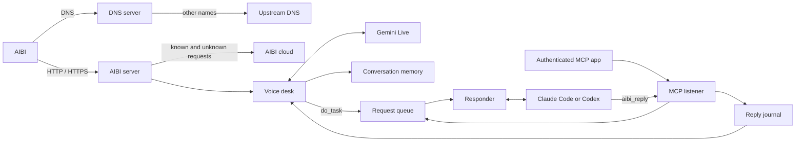

# Architecture and recovery

One Node.js process owns AIBI's servers (HTTPS, HTTP and DNS), the Gemini Live voice, the request queue, the responder connection, the MCP listener, the conversation memory, the activity log and the reply journal.

## Modules

| Location | Responsibility |
| :-- | :-- |
| `src/aibi/proxy.ts`, `http.ts` | HTTPS and HTTP servers for AIBI, HTTP parsing and streaming, forwarding to the real cloud |
| `src/aibi/routes.ts` | What is answered locally, forwarded, logged as new, and the firmware trap |
| `src/aibi/dns.ts`, `network.ts`, `tls.ts`, `ports.ts` | DNS server, this computer's address, the self-signed certificate and Linux port permission |
| `src/aibi/desk.ts` | The voice desk: one conversation at a time, voice tools, handing work over and telling results |
| `src/aibi/protocol.ts`, `speech.ts`, `audio.ts` | AIBI's reply format, live MP3 speech streams, speech gate and audio conversion |
| `src/aibi/memory.ts`, `activity.ts`, `capabilities.ts` | Conversation memory, activity log and the native action catalog |
| `src/aibi/firmware.ts` | Firmware offers, downloads, the patched package and AIBI's identity |
| `src/voice/` | Gemini Live sessions, turns and the voice's instructions and tools |
| `src/core/` | Configuration, policy, request queue, reply journal and the one-instance lock |
| `src/mcp/` | Loopback MCP listener, bearer/local key/OAuth checks and the tools |
| `src/oauth/` | The bundled sign-in for cloud apps |
| `src/operator/` | Responders, sharing with Discordinator, the setup app, install and updates |
| `src/channel/` | The Claude Code plugin's bridge to the running AiBinator |
| `tools/firmware/` | The original AiBi firmware tools |

## How a request flows

1. AIBI resolves `api.aibipocket.com` through AiBinator's DNS server and gets this computer's address.
2. A voice turn arrives as `POST /aibi/voice/detectintent`. Its audio is passed through the speech gate and streamed into the open Gemini Live session while AIBI is still uploading.
3. Gemini answers with speech, a tool call or both. Speech becomes a live MP3 stream, and AIBI gets its link, with the switch to conversation mode when it is not in it yet; AIBI then downloads it over plain HTTP.
4. `do_task` puts a request on the queue. The responder takes it, with recent conversation lines, and answers with `aibi_reply`. Progress is logged; the final reply is told by the voice now, or the next time AIBI talks.
5. Everything said, done, heard and seen is saved to memory and the activity log, and the running AiBinator writes its status to `.data/status.json` for the setup app.

The runtime is event-driven: it watches its settings files and reacts to AIBI's requests, Gemini's messages and the responder's replies as they arrive.

## Bounds and failure handling

| Resource | Bound |
| :-- | :-- |
| Request queue | 500 requests, kept 24 hours, 4,000 characters each |
| Polls | 25 requests, 20-second wait, eight waiting callers |
| Reply journal | 16,384 records, kept seven days |
| Conversation memory | 2,000 lines, 4,000 characters each; photos are deleted with their line |
| Activity log | 500 entries |
| Speech streams | Kept two minutes each |
| Voice turn | 15 seconds for Gemini to answer; up to 6 seconds of waiting for running work on a silent turn |
| Upstream DNS | 2.5 seconds per forwarded query |
| AIBI HTTP headers | 64 KiB |
| MCP HTTP | 512,000-byte body and result, 16 active dispatches, 32 connections, 120 requests/minute (600 for the local key) |
| MCP HTTP timeouts | Five-second headers, 30-second request receipt |
| Responder handover | Three tries, five seconds apart |
| Workers | Two at a time |

If the cloud cannot be reached, AIBI gets an error and the activity log a warning. If the Gemini Live connection drops, AiBinator resumes it once; otherwise the conversation ends. Startup and HTTP logs are generic, without credentials, request bodies or what was said.

## Idempotency and recovery

Each `aibi_reply` goes through the reply journal. Keys are hashed and the input is fingerprinted; a pending record is written before the reply is delivered. A retry with the same key and input returns the first result, while changed input with the same key is rejected. A reply that was interrupted mid-delivery stays pending and is not repeated automatically: check what AIBI said (`aibi_history`, `aibi_activity`) before trying again with a new key.

The request queue, open conversation and waiting results live in memory, so a restart starts a new queue epoch and drops waiting requests. Conversation memory, activity, responder conversations and their work are saved in `.data` and survive restarts. The runtime lock in `.data/runtime.lock` prevents two AiBinators from running in the same folder.
